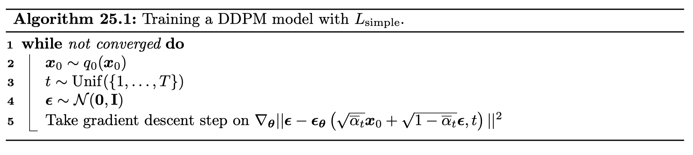
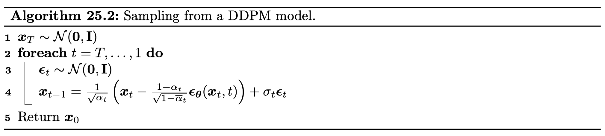

# Diffusion models

The forward diffusion gradually add noise to the input data instance until it completely becomes noise.

Let us denote:

- $x$ - input data instance
- $q(x)$ - probability density function of input data distance
- $t$ - diffusion step index
- $T$ - totoal number of diffusion steps
- $x_t$ - input data instance after $t$ steps (note: $x_0 = x$)
- $\beta_t$ - noise schedule at step $t$

We assume:

- Forward diffusion has Markove property
- The conditional distribution $q(x_t|x_{t-1})$ is Gaussian for continous $x$, multinomial for discrete $x$

## Continous data

### Forward diffusion

For continous $x$, we have

$$
q(x_{t}|x_{t-1}) = N(x_t|\sqrt{1-\beta_t}x_{t-1},\beta_tI)
$$

where $t \in [1,T]$. With Markov property, we have

$$
q(x_t|x_0) = \prod_{i=1}^t q(x_t|x_{t-1})
$$

Define the following:

- $\alpha_t = 1 - \beta_t$
- $\bar{\alpha}_{t} = \prod_{t=1}^{T} \alpha_t$

After some algebra, we can have a gaussian diffusion kernel $q(x_t|x_0)$

$$
q(x_t|x_0) = N(x_t|\sqrt{\bar{\alpha}_t}x_0, ({1 - \bar{\alpha}_t})I)
$$

With reparametrization trick, we have gaussian diffusion kernel

$$
x_t = \sqrt{\bar{\alpha}_t}x_0 + \sqrt{1 - \bar{\alpha}_t} \epsilon
$$

where $\epsilon \sim N(0, I)$. Additionally, we can have a closed-form expression $p(x_{t-1}|x_t, x_0)$ after some algebra

$$
p(x_{t-1}|x_t, x_0) = N(x_{t-1}|\tilde{\mu}_{t}(x_t, x_0), \tilde{\beta}_tI)
$$

$$
\tilde{\mu}_{t}\left(\boldsymbol{x}_{t}, \boldsymbol{x}_{0}\right)=\frac{\sqrt{\bar{\alpha}_{t-1}} \beta_{t}}{1-\bar{\alpha}_{t}} \boldsymbol{x}_{0}+\frac{\sqrt{\alpha_{t}}\left(1-\bar{\alpha}_{t-1}\right)}{1-\bar{\alpha}_{t}} \boldsymbol{x}_{t}
$$

$$
\tilde{\beta}_{t}=\frac{1-\bar{\alpha}_{t-1}}{1-\bar{\alpha}_{t}} \beta_{t}
$$

### Reverse diffusion

We want to have a approximator $p_{\theta}$ to compute $p_{\theta}(x_{t-1}|x_t)$

$$
p_{\boldsymbol{\theta}}\left(\boldsymbol{x}_{t-1} \mid \boldsymbol{x}_{t}\right)=\mathcal{N}\left(\boldsymbol{x}_{t-1} \mid \boldsymbol{\mu}_{\boldsymbol{\theta}}\left(\boldsymbol{x}_{t}, t\right), \boldsymbol{\Sigma}_{\boldsymbol{\theta}}\left(\boldsymbol{x}_{t}, t\right)\right)
$$

As $x_t$ and $x_0$ have relation $x_t = \sqrt{\bar{\alpha}_t}x_0 + \sqrt{1 - \bar{\alpha}_t} \epsilon$, we have true mean of $x_{t-1}$

$$
\tilde{\boldsymbol{\mu}}_{t}\left(\boldsymbol{x}_{t}, \boldsymbol{x}_{0}\right)=\frac{1}{\sqrt{\alpha_{t}}}\left(\boldsymbol{x}_{t}-\frac{\beta_{t}}{\sqrt{1-\bar{\alpha}_{t}}} \boldsymbol{\epsilon}\right)
$$

And estimated mean of $x_{t-1}$

$$
\boldsymbol{\mu}_{\boldsymbol{\theta}}\left(\boldsymbol{x}_{t}, \boldsymbol{x}_{0}\right)=\frac{1}{\sqrt{\alpha_{t}}}\left(\boldsymbol{x}_{t}-\frac{\beta_{t}}{\sqrt{1-\bar{\alpha}_{t}}} \boldsymbol{\epsilon}_{\boldsymbol{\theta}}\left(\boldsymbol{x}_{t}, t\right)\right)
$$

True mean and estimated mean should be as close as possible, which can be converted to true noise and expected noise should be as close as possible.

$\boldsymbol{\Sigma}_{\boldsymbol{\theta}}\left(\boldsymbol{x}_{t}, t\right)$ is often fixed at $\beta_tI$ or $\tilde{\beta}_{t}I$.

### Loss function

$$
L_{\text {simple }}=\mathbb{E}_{\boldsymbol{x}_{0} \sim q_{0}\left(\boldsymbol{x}_{0}\right), \boldsymbol{\epsilon} \sim \mathcal{N}(\mathbf{0 , I}), t \sim \operatorname{Unif}(1, T)}\left[\left\|\boldsymbol{\epsilon}-\boldsymbol{\epsilon}_{\boldsymbol{\theta}}(\underbrace{\sqrt{\bar{\alpha}_{t}} \boldsymbol{x}_{0}+\sqrt{1-\bar{\alpha}_{t}} \boldsymbol{\epsilon}}_{\boldsymbol{x}_{t}}, t)\right\|^{2}\right]
$$

Mean of squared residual between true noise and predicted noise.

### Algorithms

## Discrete data

### Forward diffusion

We require that $q\left(\boldsymbol{x}_{t-1} \mid \boldsymbol{x}_{t}, \boldsymbol{x}_{0}\right)$ have tractable form, so we can efficiently compute
$$
\begin{equation}
L_{t-1}\left(\boldsymbol{x}_{0}\right)=\mathbb{E}_{q\left(\boldsymbol{x}_{t} \mid \boldsymbol{x}_{0}\right)} D_{\mathbb{K L}}\left(q\left(\boldsymbol{x}_{t-1} \mid \boldsymbol{x}_{t}, \boldsymbol{x}_{0}\right) \| p_{\boldsymbol{\theta}}\left(\boldsymbol{x}_{t-1} \mid \boldsymbol{x}_{t}\right)\right)
\end{equation}
$$
We define the forward diffusion kernel as
$$
\begin{equation}
q\left(\boldsymbol{x}_{t} \mid \boldsymbol{x}_{t-1}\right)=\operatorname{Cat}\left(\boldsymbol{x}_{t} \mid \boldsymbol{x}_{t-1} \mathbf{Q}_{t}\right)
\end{equation}
$$
Then we have $t$-step marginal as
$$
\begin{equation}
q\left(\boldsymbol{x}_{t} \mid \boldsymbol{x}_{0}\right)=\operatorname{Cat}\left(\boldsymbol{x}_{t} \mid \boldsymbol{x}_{0} \overline{\mathbf{Q}}_{t}\right), \overline{\mathbf{Q}}_{t}=\mathbf{Q}_{1} \mathbf{Q}_{2} \cdots \mathbf{Q}_{t}
\end{equation}
$$
Then we can reverse the forwards process as
$$
\begin{equation}
q\left(\boldsymbol{x}_{t-1} \mid \boldsymbol{x}_{t}, \boldsymbol{x}_{0}\right)=\frac{q\left(\boldsymbol{x}_{t} \mid \boldsymbol{x}_{t-1}, \boldsymbol{x}_{0}\right) q\left(\boldsymbol{x}_{t-1} \mid \boldsymbol{x}_{0}\right)}{q\left(\boldsymbol{x}_{t} \mid \boldsymbol{x}_{0}\right)}=\operatorname{Cat}\left(\boldsymbol{x}_{t-1} \mid \frac{\boldsymbol{x}_{t} \mathbf{Q}_{t}^{\top} \odot \boldsymbol{x}_{0} \overline{\mathbf{Q}}_{t-1}}{\boldsymbol{x}_{0} \overline{\mathbf{Q}}_{t} \boldsymbol{x}_{t}^{\top}}\right)
\end{equation}
$$
One simple approch is to define the uniform kernel, and the stationary distribution is uniform
$$
\begin{equation}
\mathbf{Q}_{t}=\left(1-\beta_{t}\right) \mathbf{I}+\beta_{t} / K
\end{equation}
$$
With some algebra,
$$
\begin{equation}
q\left(\boldsymbol{x}_{t} \mid \boldsymbol{x}_{0}\right)=\operatorname{Cat}\left(\boldsymbol{x}_{t} \mid \bar{\alpha}_{t} \boldsymbol{x}_{0}+\left(1-\bar{\alpha}_{t}\right) / K\right)
\end{equation}
$$
Where

- $\alpha_{t}=1-\beta_{t}$
- $\bar{\alpha}_{t}=\prod_{\tau=1}^{t} \alpha_{\tau}$

Then we have the reverse forwards process
$$
\begin{equation}
q\left(\boldsymbol{x}_{t-1} \mid \boldsymbol{x}_{t}, \boldsymbol{x}_{0}\right)=\operatorname{Cat}\left(\boldsymbol{x}_{t-1} \mid \boldsymbol{\theta}_{\text {post }}\left(\boldsymbol{x}_{t}, \boldsymbol{\theta}_{0}\right)\right), \boldsymbol{\theta}_{\text {post }}\left(\boldsymbol{x}_{t}, \boldsymbol{\theta}_{0}\right)=\tilde{\boldsymbol{\theta}} / \sum_{k=1}^{K} \tilde{\theta}_{k}
\end{equation}
$$

$$
\begin{equation}
\tilde{\boldsymbol{\theta}}=\left[\alpha_{t} \boldsymbol{x}_{t}+\left(1-\alpha_{t}\right) / K\right] \odot\left[\bar{\alpha}_{t-1} \boldsymbol{x}_{0}+\left(1-\bar{\alpha}_{t-1}\right) / K\right]
\end{equation}
$$

### Backward diffusion

While it is possible to directly predict the logits $p_{\boldsymbol{\theta}}\left(\boldsymbol{x}_{t-1} \mid \boldsymbol{x}_{t}\right)$, **it is preferable to directly predict the logits of the output.** Using $\tilde{p}_{\boldsymbol{\theta}}\left(\tilde{\boldsymbol{x}}_{0} \mid \boldsymbol{x}_{t}\right)$, we can combine this with the analytical expression for $q\left(\boldsymbol{x}_{t-1} \mid \boldsymbol{x}_{t}, \boldsymbol{x}_{0}\right)$ to get
$$
\begin{equation}
p_{\boldsymbol{\theta}}\left(\boldsymbol{x}_{t-1} \mid \boldsymbol{x}_{t}\right) \propto \sum_{\tilde{\boldsymbol{x}}_{0}} q\left(\boldsymbol{x}_{t-1} \mid \boldsymbol{x}_{t}, \tilde{\boldsymbol{x}}_{0}\right) \tilde{p}_{\boldsymbol{\theta}}\left(\tilde{\boldsymbol{x}}_{0} \mid \boldsymbol{x}_{t}\right)
\end{equation}
$$
One advantage of this approach, compared to directly learning $p_{\boldsymbol{\theta}}\left(\boldsymbol{x}_{t-1} \mid \boldsymbol{x}_{t}\right)$, it that the model will automatically satisfy any sparsity constraints in $Q_t$.

In addition, we can perform inference with $k$ steps at a time, by predicting
$$
p_{\boldsymbol{\theta}}\left(\boldsymbol{x}_{t-k} \mid \boldsymbol{x}_{t}\right) \propto \sum_{\tilde{\boldsymbol{x}}_{0}} q\left(\boldsymbol{x}_{t-k} \mid \boldsymbol{x}_{t}, \tilde{\boldsymbol{x}}_{0}\right) \tilde{p}_{\boldsymbol{\theta}}\left(\tilde{\boldsymbol{x}}_{0} \mid \boldsymbol{x}_{t}\right)
$$
For uniform diffusion, we can use cosine schedule of the form

- $\alpha_{t}=\cos \left(\frac{t / T+s}{1+s} \frac{\pi}{2}\right)$ where $s=0.08$

### Loss function

$$
\begin{aligned} \mathcal{L}\left(\boldsymbol{x}_{0}\right) & =-\mathbb{E}_{q\left(\boldsymbol{x}_{1: T} \mid \boldsymbol{x}_{0}\right)}\left[\log \frac{p\left(\boldsymbol{x}_{T}\right)}{q\left(\boldsymbol{x}_{T} \mid \boldsymbol{x}_{0}\right)}+\sum_{t=2}^{T} \log \frac{p_{\boldsymbol{\theta}}\left(\boldsymbol{x}_{t-1} \mid \boldsymbol{x}_{t}\right)}{q\left(\boldsymbol{x}_{t-1} \mid \boldsymbol{x}_{t}, \boldsymbol{x}_{0}\right)}+\log p_{\boldsymbol{\theta}}\left(\boldsymbol{x}_{0} \mid \boldsymbol{x}_{1}\right)\right] \\ & =\underbrace{D_{\mathbb{K L} L}\left(q\left(\boldsymbol{x}_{T} \mid \boldsymbol{x}_{0}\right) \| p\left(\boldsymbol{x}_{T}\right)\right)}_{L_{T}\left(\boldsymbol{x}_{0}\right)} \\ & +\sum_{t=2}^{T} \mathbb{E}_{q\left(\boldsymbol{x}_{t} \mid \boldsymbol{x}_{0}\right)} \underbrace{D_{\mathbb{K} \mathbb{L}}\left(q\left(\boldsymbol{x}_{t-1} \mid \boldsymbol{x}_{t}, \boldsymbol{x}_{0}\right) \| p_{\boldsymbol{\theta}}\left(\boldsymbol{x}_{t-1} \mid \boldsymbol{x}_{t}\right)\right)}_{L_{t-1}\left(\boldsymbol{x}_{0}\right)}-\underbrace{\mathbb{E}_{q\left(\boldsymbol{x}_{1} \mid \boldsymbol{x}_{0}\right)} \log p_{\boldsymbol{\theta}}\left(\boldsymbol{x}_{0} \mid \boldsymbol{x}_{1}\right)}_{L_{0}\left(\boldsymbol{x}_{0}\right)}\end{aligned}
$$

$$
p\left(\boldsymbol{x}_{0} \mid \boldsymbol{x}_{1}\right)=\mathcal{C}\left(\boldsymbol{x}_{0} \mid \hat{\boldsymbol{x}}_{0}\right)
$$

$$
p\left(\boldsymbol{x}_{t-1} \mid \boldsymbol{x}_{t}\right)=\mathcal{C}\left(\boldsymbol{x}_{t-1} \mid \boldsymbol{\theta}_{\text {post }}\left(\boldsymbol{x}_{t}, \hat{\boldsymbol{x}}_{0}\right)\right)
$$

$$
\hat{\boldsymbol{x}}_{0}=\mu\left(\boldsymbol{x}_{t}, t\right)
$$

The $L_{t-1}$ terms
$$
\mathrm{KL}\left(q\left(\boldsymbol{x}_{t-1} \mid \boldsymbol{x}_{t}, \boldsymbol{x}_{0}\right) \mid p\left(\boldsymbol{x}_{t-1} \mid \boldsymbol{x}_{t}\right)\right)=\mathrm{KL}\left(\mathcal{C}\left(\boldsymbol{\theta}_{\text {post }}\left(\boldsymbol{x}_{t}, \boldsymbol{x}_{0}\right)\right) \mid \mathcal{C}\left(\boldsymbol{\theta}_{\text {post }}\left(\boldsymbol{x}_{t}, \hat{\boldsymbol{x}}_{0}\right)\right)\right)
$$
can be computed using $\left.\sum_{k} \boldsymbol{\theta}_{\text {post }}\left(\boldsymbol{x}_{t}, \boldsymbol{x}_{0}\right)\right)_{k} \cdot \log \frac{\left.\boldsymbol{\theta}_{\text {post }}\left(\boldsymbol{x}_{t}, \boldsymbol{x}_{0}\right)\right)_{k}}{\left.\boldsymbol{\theta}_{\text {post }}\left(\boldsymbol{x}_{t} \hat{\boldsymbol{x}}_{0}\right)\right)_{k}}$

Further more, to compute $\log p\left(\boldsymbol{x}_{0} \mid \boldsymbol{x}_{1}\right)$, use that $x_0$ is one hot
$$
\log p\left(\boldsymbol{x}_{0} \mid \boldsymbol{x}_{1}\right)=\sum_{k} \boldsymbol{x}_{0, k} \log \hat{\boldsymbol{x}}_{0, k}
$$
